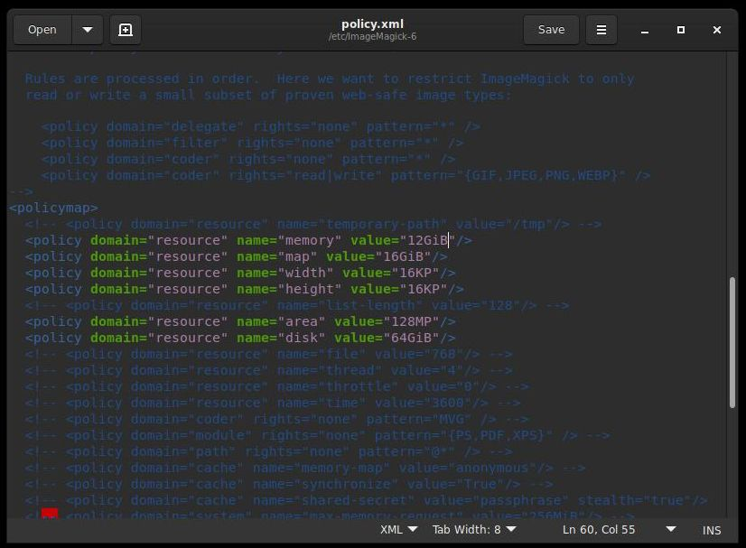
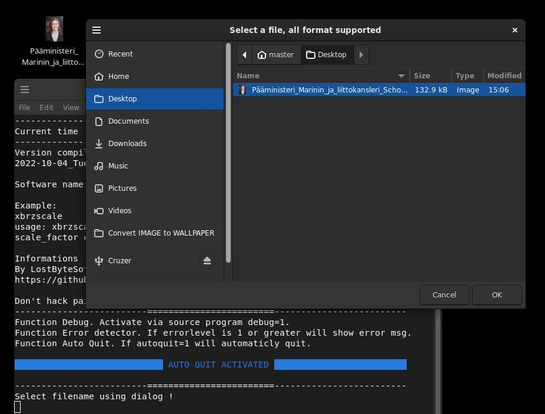
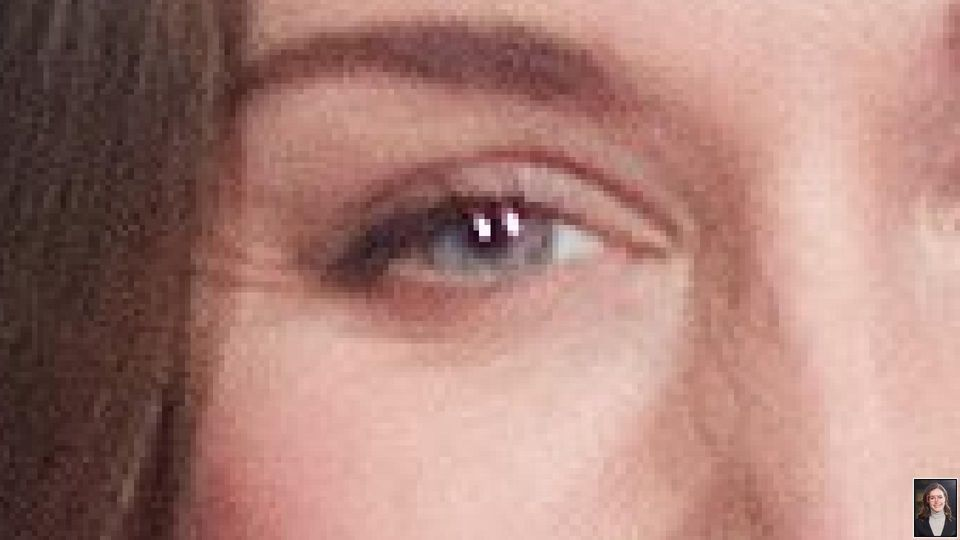
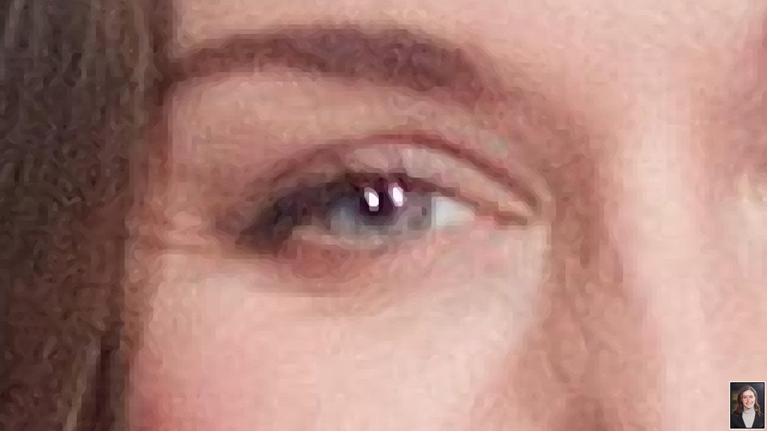
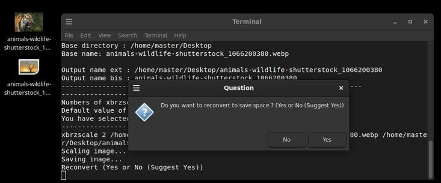
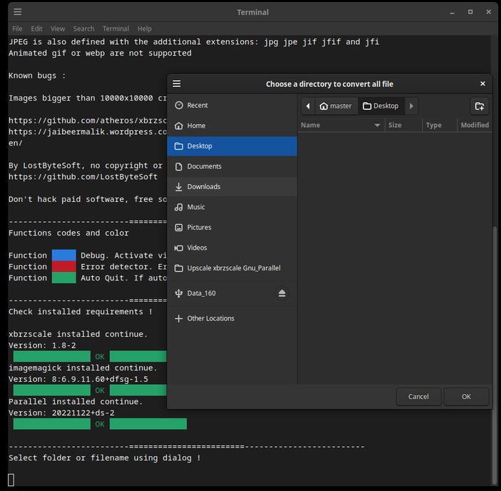

# LBS XbrScale

LostByteSoft ; Upscale xbrzscale Gnu_Parallel

Upscale image to get better quality.

Don't hack paid software, free software exists and does the job better.

This is a BASH frontend (gui?) is for gave data into xbrzscale.

No command line needed you just click on files or folders.

Features:
--------------------------------------------------------------------

	Bash, xbrzscale, imagemagick and Gnu_parallel are used.
	Remember if there nothing to upscale, the results will be none.

Files
--------------------------------------------------------------------

*** represent the version of the bash program.

Upscale_ONE_FILE_image_xbrzscale***.sh

	ONE file will be upscaled.
	Upscale one file you specify.
	To JPG
	Select ONE file and upscale it.
	Re-Compress image if you want.

Upscale_ALL_FOLDER_image_xbrzscale***.sh

	All file in folder will be upscaled.
	One by one file.
	Upscale all files in folder you specified.
	To JPG
	Select one FOLDER and upscale all image (one by one).
	Re-Compress image if you want.

Upscale_ALL_PARALLEL_image_xbrzscale***.sh

	All file in folder with Gnu_Parallel will be upscaled.
	You will need 'Gnu Parallel' for this one work.
	Same as 'all folder' but with Gnu parallel.
	Multiples job at the same time.
	To JPG
	Faster
	Select one FOLDER and GNU parallel upscale it.
	Re-Compress image if you want.
	

xbrzscale versions ?
--------------------------------------------------------------------

You can find xbrzscale easily on internet or maybe in your package manager.
site : https://github.com/atheros/xbrzscale

For use with libc6 old versions:

	xbrzscale_1.8-2_amd64_2.30.deb

For use with libc6 new versions:

	xbrzscale_1.8-2_amd64_2.35.deb

How to ?
--------------------------------------------------------------------

-Make it executable.

-Double click on it, select your file OR folder and press enter.

-Files names are pretty revellant to what a files does.

-YOU can easily edit the sources to convert to webp

ImageMagick limitationS
--------------------------------------------------------------------
	Policy to change to the file :
	sudo gedit /etc/ImageMagick-6/policy.xml

	Tested on : ImageMagick 6.9.11-60 Q16 x86_64
	
	sudo gedit /etc/ImageMagick-6/policy.xml
	
	ImgMack policy are SO LOW you need to change them to something usable
	ex: mem 12GiB , disk 64GiB
		
Image files:
--------------------------------------------------------------------

Screen of Upscale ONE FILE image xbrzscale.sh

Original image file.

Upscaled image file.

Image of the script. (Upscale_ONE_FILE_image_xbrzscale.sh)

Select folder:

Compatibility
--------------------------------------------------------------------
Linux bash (Debian 10 & up)
All deb distro.

Versions
--------------------------------------------------------------------
2023-03-05 somes updates to files
2023-02-16 some updates
2022-11-08 some updates
2022-10-10 first release

End-user license agreement (eula)
--------------------------------------------------------------------

 	JUST DO WHAT THE F*** YOU WANT WITH THE PUBLIC LICENSE
 	
 	Version 3.1415926532 (January 2022)
 	
 	TERMS AND CONDITIONS FOR COPYING, DISTRIBUTION AND MODIFICATION
    	
	Everyone is permitted to copy and distribute verbatim or modified copies of
 	this license document.
 	
 	As is customary and in compliance with current global and interplanetary
 	regulations, the author of these pages disclaims all liability for the
 	consequences of the advice given here, in particular in the event of partial
 	or total destruction of the material, Loss of rights to the manufacturer
 	warranty, electrocution, drowning, divorce, civil war, the effects of radiation
 	due to atomic fission, unexpected tax recalls or encounters with
 	extraterrestrial beings elsewhere.
 	
 	YOU MUST ACCEPT THESES TERMS OR NOTHING WILL HAPPEN.
 	
 	LostByteSoft no copyright or copyleft we are in the center.
 	
 	You can send your request and your Christmas wishes to this address:
 	
 		Père Noël
 		Pôle Nord, Canada
 		H0H 0H0

--------------------------------------------------------------------
